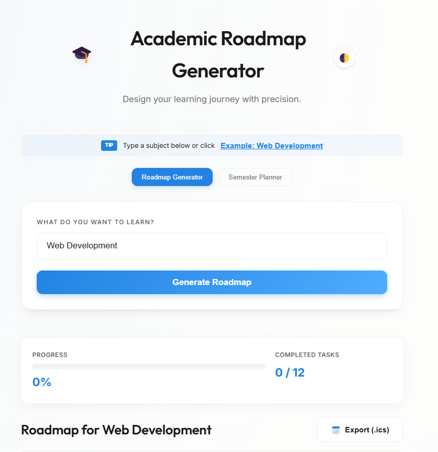

# Academic Roadmap Generator 🎓

Academic Roadmap Generator is a minimalist, Notion-inspired web application designed to help students and lifelong learners bridge the gap between "wanting to learn" and "knowing how to learn." It generates structured, week-by-week learning paths for any subject and allows users to export these goals directly to their calendars.

## Motivation
Modern learners are often overwhelmed by the sheer volume of information available. The biggest hurdle is often the first step: organizing a logical sequence of study. This tool provides a clear starting point and actionable milestones to ensure consistent progress.

## Features
- **Instant Roadmap Generation**: Get a 4-week structured plan for any topic.
- **Progress Tracking**: Check off tasks as you go. Your progress is saved automatically.
- **Smart Templates**: Specialized paths for Coding, Mathematics, Art, Language, and History.
- **ICS Calendar Export**: One-click export to Google Calendar, Apple Calendar, or Outlook.
- **Premium UI/UX**: Clean, responsive design with glassmorphism and smooth animations.

## Try Live
https://YULINYI123.github.io/Academic-Roadmap-3189415066

## How to Build/Run
1. Clone the repository.
2. Open `index.html` in any modern web browser.
3. No build step required (Pure JavaScript/CSS).

## Screenshots

## License
MIT
